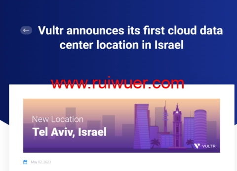

# VULTR 新增以色列特拉维夫机房：全球第 32 个数据中心上线，月付 2.5 美元起步

---

如果你需要一个机房选择多、按小时计费的 VPS 服务商，VULTR 可能是个不错的选择。最近他们新开了以色列特拉维夫机房，这是他们在亚洲地区的第 8 个数据中心。对于需要覆盖中东地区业务的用户来说，这个新机房能提供更低的延迟和更稳定的连接。全球 32 个机房任你挑，价格从月付 2.5 美元起步,支持按小时付费，用多少付多少。

---

## VULTR 是什么

VULTR 是 2014 年成立的国外 VPS 商家。他们的特点是按小时计费，不用的时候可以随时删除实例,只扣实际使用的费用。产品线包括 Cloud Compute（云计算）、Optimized Cloud Compute（优化云计算）、Cloud GPU（云 GPU）、Bare Metal（裸金属服务器）等多个系列。

根据 CPU 和磁盘类型,还分为 AMD High Performance、Intel High Performance、High Frequency、Regular Performance 等不同配置。支付方式支持支付宝、微信、PayPal、信用卡,国内用户付款很方便。

## 新增特拉维夫机房意味着什么

特拉维夫是 VULTR 在亚洲地区的第 8 个机房,也是他们全球的第 32 个数据中心。对于需要覆盖中东、北非地区用户的业务来说,这个机房能提供更好的访问速度。

目前 VULTR 的机房分布情况：

**北美方向**：洛杉矶、硅谷、迈阿密、亚特兰大、芝加哥、纽约、达拉斯、西雅图、圣地亚哥(智利)、圣保罗(巴西)、多伦多(加拿大)、墨西哥

**欧洲方向**：伦敦(英国)、曼彻斯特(英国)、阿姆斯特丹(荷兰)、法兰克福(德国)、马德里(西班牙)、巴黎(法国)、华沙(波兰)、斯德哥尔摩(瑞典)

**亚洲方向**：东京(日本)、大阪(日本)、首尔(韩国)、班加罗尔(印度)、德里(印度)、孟买(印度)、新加坡、特拉维夫(以色列)

**其他地区**：悉尼(澳大利亚)、墨尔本(澳大利亚)、约翰内斯堡(南非)

机房多的好处是你可以根据业务需求随时切换。比如你的用户主要在欧洲,就选欧洲机房；如果业务扩展到亚洲,再开几台亚洲机房的实例就行。

## 技术配置和价格

VULTR 的 VPS 基于 KVM 架构,支持安装 Windows 或 Linux 系统,也支持自定义 ISO 安装。如果你需要高性能配置,可以选择 AMD High Performance 系列,最低配置每月只需要多加 1 美元,就能用上 AMD EPYC CPU 和 NVMe SSD 磁盘。

所有套餐都提供 IPv6 支持,可以选择自动备份和 DDoS 攻击防御等附加服务。对于需要稳定服务且预算有限的用户来说，👉 [选择合适的云服务商能帮你省下不少运维成本，特别是在全球部署多个节点时](https://www.vultr.com/?ref=9738262-9J)。VULTR 的按小时计费模式让你可以随时调整资源,避免资源浪费。

## 当前优惠活动

### 新用户 250 美元赠金

新注册用户可以获得 250 美元账户余额用于免费试用。这个额度足够你测试各个机房的性能和稳定性了。

**优惠说明**：使用 250 美元免费额度免费试用 VULTR,仅限新客户。

### 充值赠金活动

VULTR 目前还在进行充值多少送多少的活动,最高充值 100 美元赠送 100 美元。赠送的 100 美元有效期是一年,对于长期使用的用户来说相当划算。

**优惠说明**：双倍存款活动,当您开设新账户时,VULTR 将匹配您的第一笔存款,最高 100 美元。不能与其他优惠结合使用,仅限新客户。

## 适合什么场景

VULTR 的按小时计费和多机房特点,让它特别适合以下场景：

- 需要在全球多个地区部署节点的业务
- 开发测试环境(用完就删,成本可控)
- 流量波动较大的应用(可以随时扩容或缩容)
- 需要快速切换机房的场景
- 预算有限但需要灵活配置的个人项目

---

## 总结

VULTR 新增的特拉维夫机房扩大了他们在中东地区的覆盖范围。如果你需要一个机房选择多、计费灵活的 VPS 服务商,VULTR 值得考虑。全球 32 个数据中心让你可以根据业务需求灵活部署,按小时计费的模式也能有效控制成本。👉 [对于需要全球化部署的业务来说,选择覆盖范围广、性价比高的云服务商能大幅降低运维成本和部署难度](https://www.vultr.com/?ref=9738262-9J)。
